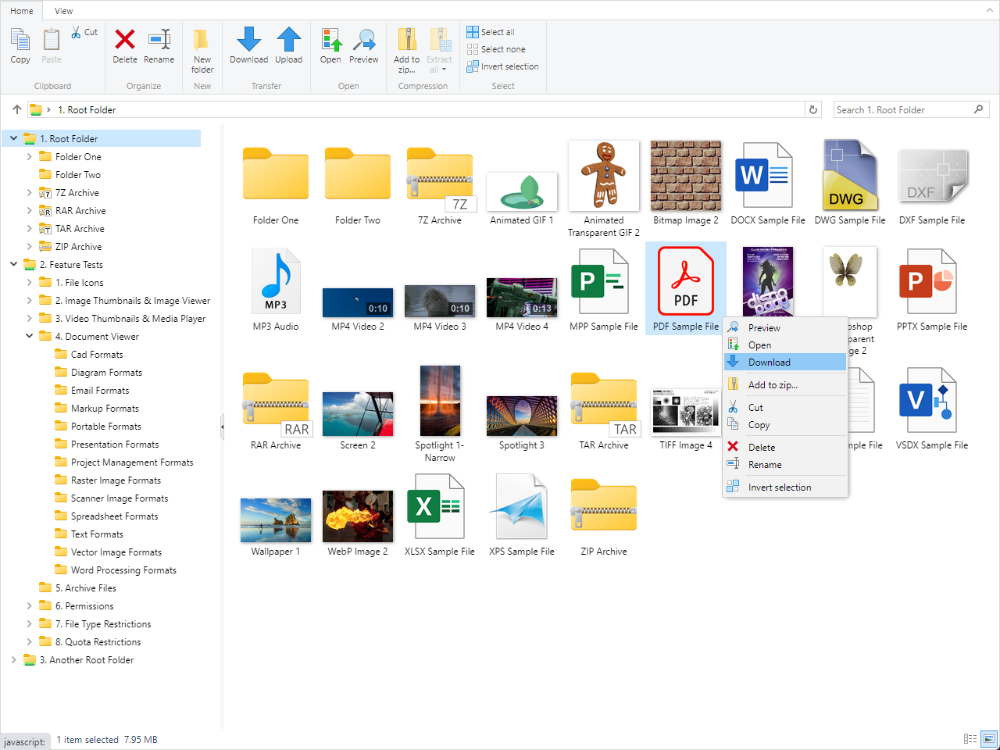

# File Manager and File Uploader for ASP.NET

Integrate a file manager into your ASP.NET application or site rapidly.

- Browse and manage files with access control.
- Accept files with the advanced upload functionality (uploader is also available as a standalone component).
- Offer a structured and neat download area.
- Preview documents (70+ file formats, including PDF & Microsoft Office), images, audios and videos.

**Note:** This project contains a fully working version of the product, however without a license key it will run in trial mode. For more information, please see [ASP.NET File Manager and ASP.NET File Uploader](https://www.gleamtech.com/fileultimate) product page.

### Live Demo:
https://demos.gleamtech.com/fileultimate/

### Adding references to FileUltimate assemblies:
https://docs.gleamtech.com/fileultimate/html/adding-references-to-fileultimate-assemblies.htm

### Using FileUltimate in an ASP.NET Core project:
https://docs.gleamtech.com/fileultimate/html/using-fileultimate-in-an-asp-net-core-project.htm

### Using FileUltimate in an ASP.NET MVC project:
https://docs.gleamtech.com/fileultimate/html/using-fileultimate-in-an-asp-net-mvc-project.htm

### Using FileUltimate in an ASP.NET WebForms project:
https://docs.gleamtech.com/fileultimate/html/using-fileultimate-in-an-asp-net-webforms-project.htm

### Showcase videos:

