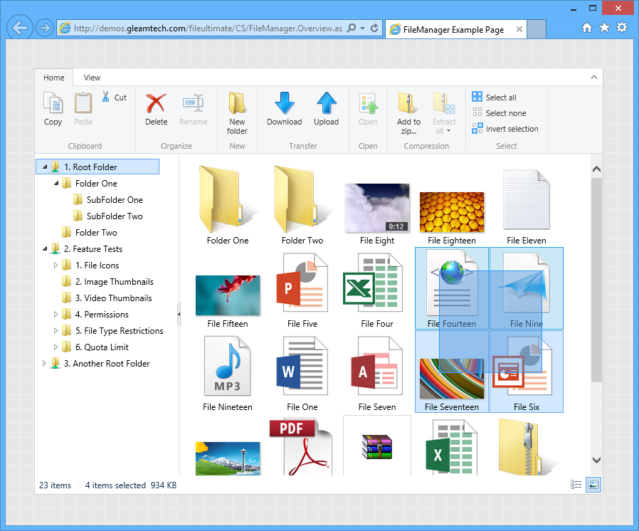

#  FileUltimate: ASP.NET File Manager
File Manager Control for ASP.NET WebForms and ASP:NET MVC 3+ (.NET Framework 4.0+).

Integrate a file manager into your ASP.NET application or site rapidly. 

- Browse and manage files with access control. 
- Accept files with the advanced upload functionality.
- Offer a structured and neat download area.
- Preview documents (50+ file formats, including PDF &#169; Microsoft Office), images, audios and videos.



**Note:** This project contains a fully working version of the product, however without a license key it will run in trial mode. For more information, please see [FileUltimate: ASP.NET File Manager](http://www.gleamtech.com/fileultimate) product page.

### To use FileUltimate in an ASP.NET MVC Project, do the following in Visual Studio:

1.  Add references to FileUltimate assemblies. There are two ways to perform this:
      
    -   Add reference to **GleamTech.Core.dll** and **GleamTech.FileUltimate.dll** found in "Bin" folder of FileUltimate-vX.X.X.X.zip package which you already downloaded and extracted.
          

        >The other DLLs in the same folder, i.e. **GleamTech.ImageUltimate.dll**, **GleamTech.VideoUltimate.dll** and **GleamTech.DocumentUltimate.dll** are assemblies that FileUltimate depends on for some of the features. They are separate assemblies as they are also standalone products with the same names. MSbuild or Visual Studio will automatically copy these 3 DLLs along with the main referenced assembly **GleamTech.FileUltimate.dll** to your bin folder during build so they don't need to be referenced directly (unless you are using these products separately in the same project and you have a license for them). Note that even without these 3 DLLs, FileUltimate will work but it will just turn off the corresponding features such as generating image or video thumbnails or the document viewer. So with this modular approach, you can opt-out of the features you do not need by excluding the corresponding DLL, i.e. MSBuild or Visual Studio would automatically copy a dependency only if that DLL is found in the same folder as the main referenced DLL so you can simply delete/move a DLL to opt-out.

    -   Or install NuGet package and add references automatically via NuGet Package Manager in Visual Studio: open **Tools -\> NuGet Package Manager -\> Package Manager Console** and run this command:

          
        `Install-Package FileUltimate`

     If you prefer using the user interface when working with NuGet, you can also install the package this way: open **Tools -\> NuGet Package Manager -\> Manage NuGet Packages for Solution**, enter **FileUltimate** in the search field, and click **Install** button on the found package.          

2.  Set FileUltimate's global configuration. For example, you may want to set the license key. Insert some of the following lines (if overriding a default value is required) into the ```Application_Start``` method of your **Global.asax.cs**:

    ~~~~ {style="font-family: Consolas; font-size: 13; color: black; background: white;"}
    //Set this property only if you have a valid license key, otherwise do not 
    //set it so FileUltimate runs in trial mode.  
    FileUltimateConfiguration.Current.LicenseKey = "QQJDJLJP34...";
    ~~~~

    Alternatively you can specify the configuration in ```<appSettings>``` tag of your Web.config.

    ~~~~ {style="font-family: Consolas; font-size: 13; color: black; background: white;"}
    <appSettings> 
      <add key="FileUltimate:LicenseKey" value="QQJDJLJP34..." /> 
    </appSettings>
    ~~~~

    As you would notice, FileUltimate: prefix maps to FileUltimateConfiguration.Current.
      

3.  Open one of your View pages (eg. Index.cshtml) and at the top of your page add the necessary namespaces:

    ~~~~ {style="font-family: Consolas; font-size: 13; color: black; background: white;"}
    @using GleamTech.Web.Mvc
    @using GleamTech.FileUltimate
    ~~~~

    Alternatively you can add the namespaces globally in **Views/web.config** to avoid adding namespaces in your pages every time:

    ~~~~ {style="font-family: Consolas; font-size: 13; color: black; background: white;"}
      <system.web.webPages.razor>
        <pages pageBaseType="System.Web.Mvc.WebViewPage">
          <namespaces>
            .
            .
            .
            <add namespace="GleamTech.Web.Mvc" />
            <add namespace="GleamTech.FileUltimate" />
          </namespaces>
        </pages>
      </system.web.webPages.razor>
    ~~~~

    Now in your page insert these lines:

    ~~~~ {style="font-family: Consolas; font-size: 13; color: black; background: white;"}
    @{
        var fileManager = new FileManager
        {
            Width = 800,
            Height = 600,
            Resizable = true
        };
     
        var rootFolder = new FileManagerRootFolder
        {
            Name = "A Root Folder",
            Location = "~/App_Data/RootFolder1"
        };
     
        rootFolder.AccessControls.Add(new FileManagerAccessControl
        {
            Path = @"\",
            AllowedPermissions = FileManagerPermissions.Full
        });
     
        fileManager.RootFolders.Add(rootFolder);
    }
    <html>
    <head>
        @Html.RenderCss(fileManager)
        @Html.RenderJs(fileManager)
    </head>
    <body>
        @Html.RenderControl(fileManager)
    </body>
    </html>
    ~~~~

    This will render a file manager control in the page which displays one root folder named "A Root Folder" which points to "\~/App\_Data/RootFolder1" with Full permissions.

###To use FileUltimate in an ASP.NET WebForms Project, do the following in Visual Studio:

1.  Add references to FileUltimate assemblies. There are two ways to perform this:
      
    -   Add reference to **GleamTech.Core.dll** and **GleamTech.FileUltimate.dll** found in "Bin" folder of FileUltimate-vX.X.X.X.zip package which you already downloaded and extracted.
          

        >The other DLLs in the same folder, i.e. **GleamTech.ImageUltimate.dll**, **GleamTech.VideoUltimate.dll** and **GleamTech.DocumentUltimate.dll** are assemblies that FileUltimate depends on for some of the features. They are separate assemblies as they are also standalone products with the same names. MSbuild or Visual Studio will automatically copy these 3 DLLs along with the main referenced assembly **GleamTech.FileUltimate.dll** to your bin folder during build so they don't need to be referenced directly (unless you are using these products separately in the same project and you have a license for them). Note that even without these 3 DLLs, FileUltimate will work but it will just turn off the corresponding features such as generating image or video thumbnails or the document viewer. So with this modular approach, you can opt-out of the features you do not need by excluding the corresponding DLL, i.e. MSBuild or Visual Studio would automatically copy a dependency only if that DLL is found in the same folder as the main referenced DLL so you can simply delete/move a DLL to opt-out.

    -   Or install NuGet package and add references automatically via NuGet Package Manager in Visual Studio: open **Tools -\> NuGet Package Manager -\> Package Manager Console** and run this command:

          
        `Install-Package FileUltimate`

     If you prefer using the user interface when working with NuGet, you can also install the package this way: open **Tools -\> NuGet Package Manager -\> Manage NuGet Packages for Solution**, enter **FileUltimate** in the search field, and click **Install** button on the found package.          

2.  Set FileUltimate's global configuration. For example, you may want to set the license key. Insert some of the following lines (if overriding a default value is required) into the ```Application_Start``` method of your **Global.asax.cs**:


    ~~~~ {style="font-family: Consolas; font-size: 13; color: black; background: white;"}
    //Set this property only if you have a valid license key, otherwise do not 
    //set it so FileUltimate runs in trial mode.  
    FileUltimateConfiguration.Current.LicenseKey = "QQJDJLJP34...";
    ~~~~

    Alternatively you can specify the configuration in ```<appSettings>``` tag of your Web.config.


    ~~~~ {style="font-family: Consolas; font-size: 13; color: black; background: white;"}
    <appSettings> 
      <add key="FileUltimate:LicenseKey" value="QQJDJLJP34..." /> 
    </appSettings>
    ~~~~

    As you would notice, FileUltimate: prefix maps to FileUltimateConfiguration.Current.
      

3.  Open one of your pages (eg. Default.aspx) and at the top of your page add add the necessary namespaces:


    ~~~~ {style="font-family: Consolas; font-size: 13; color: black; background: white;"}
    <%@ Register TagPrefix="GleamTech" Namespace="GleamTech.FileUltimate" Assembly="GleamTech.FileUltimate" %>
    ~~~~

    Alternatively you can add the namespaces globally in **Web.config** to avoid adding namespaces in your pages every time:


    ~~~~ {style="font-family: Consolas; font-size: 13; color: black; background: white;"}
      <system.web>
        <pages>
          <controls>
            .
            .
            .
            <add tagPrefix="GleamTech" namespace="GleamTech.FileUltimate" assembly="GleamTech.FileUltimate" />
          </controls>
        </pages>
      </system.web>
    ~~~~

    Now in your page insert these lines:

    ~~~~ {style="font-family: Consolas; font-size: 13; color: black; background: white;"}
    <GleamTech:FileManager ID="fileManager" runat="server" 
                            Width="800"
                            Height="600" 
                            Resizable="True">
        
        <GleamTech:FileManagerRootFolder Name="A Root Folder" Location="~/App_Data/RootFolder1" > 
            <GleamTech:FileManagerAccessControl Path="\" AllowedPermissions="Full"/> 
        </GleamTech:FileManagerRootFolder>
     
    </GleamTech:FileManager> 
    ~~~~

    This will render a file manager control in the page which displays one root folder named "A Root Folder" which points to "\~/App\_Data/RootFolder1" with Full permissions.

### Optional:

FileUltimate does not depend on any Web.config settings to work (it's config-free for easy deployment). However if you want to support the lowest level upload method Html4 which is the only possible method for old browsers without Html5 or Flash or Silverlight support, then you will need to increase the request limits (ASP.NET's default is 4MB) so that you can upload files larger than 4MB on these browsers.
 Edit your project's Web.config file and add the following settings inside \<configuration\> tag:
  

~~~~ {style="font-family: Consolas; font-size: 13; color: black; background: white;"}
  <!-- 
    Html4 upload method requires the limits to be set to the maximum value (2 GB).
    Other upload methods use chunking so there is no 2GB limit for them.
  -->
  <location path="fileuploader.ashx">
    <system.webServer>
      <security>
        <requestFiltering>
          <!-- 
            Maximum value for maxAllowedContentLength (in bytes) is 2147483648 (2GB). 
            maxAllowedContentLength should be always equal to (or greater than) maxRequestLength x 1024.
          -->
          <requestLimits maxAllowedContentLength="2147483648"/>
        </requestFiltering>
      </security>
    </system.webServer>
    <system.web>
      <!-- Maximum value for maxRequestLength (in kilobytes) is 2097152 (2GB) -->
      <httpRuntime maxRequestLength="2097152"/>
    </system.web>
  </location>
~~~~

